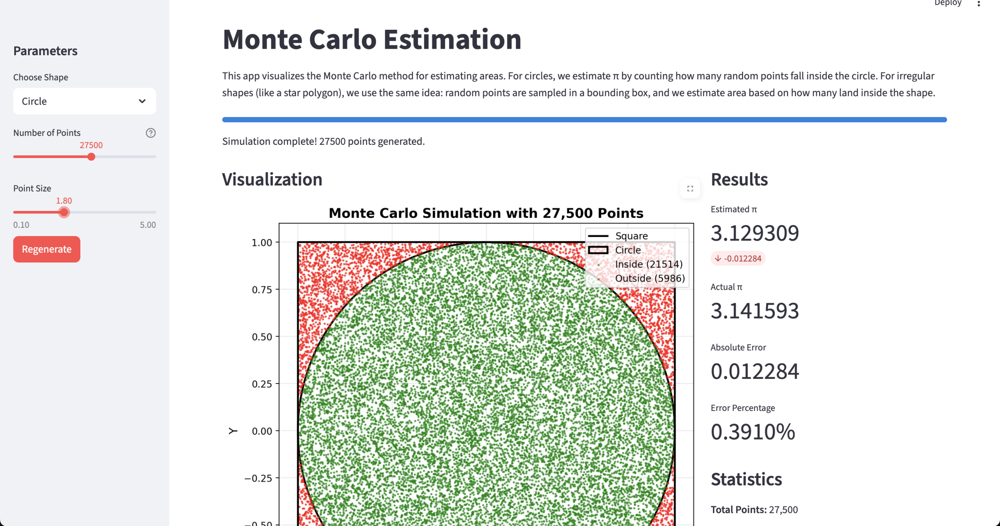
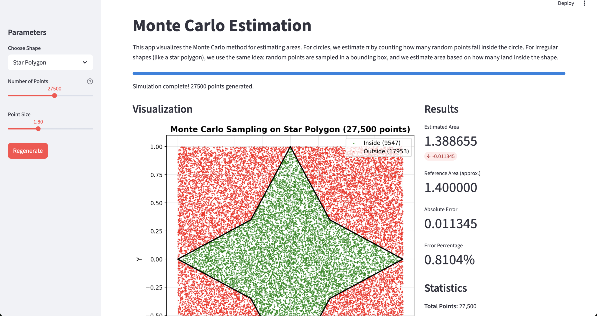

# CS_255_GroupProject

Final Project - Monte Carlo estimation examples (pi and irregular-shape areas)

## Description

This project implements Monte Carlo simulations to estimate π (using a circle) and to estimate areas of irregular shapes (for example, a star-shaped polygon) using random sampling. The interactive Streamlit app visualizes how random points within a square or bounding box can be used to approximate quantities by testing whether points fall inside the target shape.

## Introduction

In Unit 9, we learned about random number generators (RNGs) and how they play a crucial role in many algorithms and real-world applications. RNGs allow computers to simulate randomness, which is essential for algorithms that rely on probability, estimation, and simulation.

While exploring ideas from Discussion Board 3, our group decided to expand on the classic Monte Carlo method for estimating π. Monte Carlo methods use random sampling to approximate values that may be difficult or time-consuming to calculate exactly. The idea is that by generating a large number of random points and analyzing how they fall within certain geometric regions, we can estimate quantities like areas or ratios.

To build on this day, we chose two related tasks:

### 1. Estimating π using Monte Carlo Simulation

We simulate random points inside a square and check how many land inside the quarter circle. The ratio of these points approximates π.
This directly demonstrates the power of RNGs: we rely on randomness to approximate a value that has no simple finite formula.

### 2. Estimating the Area of a Star Polygon (Irregular Shape)

We also apply the Monte Carlo method to an irregular star-shaped polygon. Unlike simple geometric shapes (circles, squares, triangles), the area of an irregular shape can be tedious to compute analytically.
By randomly generating points within a bounding box and counting how many land inside the star, we can estimate its area.
This shows how Monte Carlo allows us to solve problems that would otherwise require complex formulas.

## How RNG is useful

Our entire project depends on generating random numbers reliably.
Because RNGs produce values that are unpredictable (but uniformly distributed), they let us:

- simulate thousands or millions of random points
- approximate areas using probability
- visualize how randomness converges to an accurate result as sample size increases
  This ties directly to the concepts we learned in Unit 9, especially how RNGs enable probabilistic algorithms like Monte Carlo.

## Features

- Interactive visualization of Monte Carlo simulation
- Adjustable number of sample points (100 to 50,000)
- Real-time π and area estimation with error metrics
- Convergence graph showing accuracy improvement
- Color-coded points (green = inside circle, red = outside)
- Irregular shape (star polygon) visualization with area estimation

## Setup and Installation

### 1. Clone the repository

```bash
git clone https://github.com/Eugenefut19/CS_255_GroupProject.git
cd CS_255_GroupProject
```

### 2. Create and activate a virtual environment (recommended)

**On macOS/Linux:**

```bash
python3 -m venv venv
source venv/bin/activate
```

**On Windows:**

```bash
python -m venv venv
venv\Scripts\activate
```

### 3. Install required packages

```bash
pip install -r requirements.txt
```

## How to Run

### Run the Streamlit App (Interactive Visualization)

```bash
streamlit run streamlit_app.py
```

The app will open in your default browser at `http://localhost:8501`


### Run the Basic Monte Carlo pi estimation Python Script

```bash
python MonteCarlo_pi_estimate.py
```

Example output:

```
Monte Carlo pi estimation summary (N=10000)
Points inside circle : 7783
Points outside circle: 2217
Percent inside       : 77.83%
Estimated pi         : 3.1132
```

## Usage

1. Launch the Streamlit app using the command above
2. Use the sidebar slider to adjust the number of sample points
3. Click "Regenerate" to run a new simulation with different random points
4. Observe the visualization and convergence graph
5. Check the statistics panel for accuracy metrics

## Irregular Shapes (Star Polygon)

This project also includes an irregular-shape example: a star-shaped polygon. The same Monte Carlo approach is used — random points are sampled in the bounding box and a point-in-polygon test decides whether a point lies inside the star. The app provides:

- A visualization of sampled points (green = inside the star, red = outside)
- An estimated area for the star polygon (displayed in the Results panel)
- A reference area (approx. 1.40) used for comparison so you can see absolute and percent error
- A convergence plot showing how the area estimate evolves as you increase sample count

Use the sidebar control in the Streamlit app to switch between "Circle" and "Star Polygon". The default sidebar slider still controls the number of sample points (100–50,000). For the star polygon the app shows matching metrics to the circle view: estimated value, reference value, absolute error, and error percentage.



## How It Works

The Monte Carlo method estimates π by:

1. Generating random points within a 2×2 square (from -1 to 1 on both axes)
1. Testing if each point falls inside the target shape (for a circle: x² + y² ≤ 1; for irregular shapes: a point-in-polygon test)
1. Calculating the ratio: (points inside shape) / (total points)
1. For the circle this ratio ≈ π/4, so multiplying by 4 gives an estimate of π. For irregular shapes the ratio times the bounding-box area gives an area estimate.

As the number of sample points increases, the estimate converges (in probability) to the true value for the chosen shape.

## Requirements

- Python 3.9+
- streamlit
- matplotlib
- numpy

## Deactivating Virtual Environment

When you're done, deactivate the virtual environment:

```bash
deactivate
```
